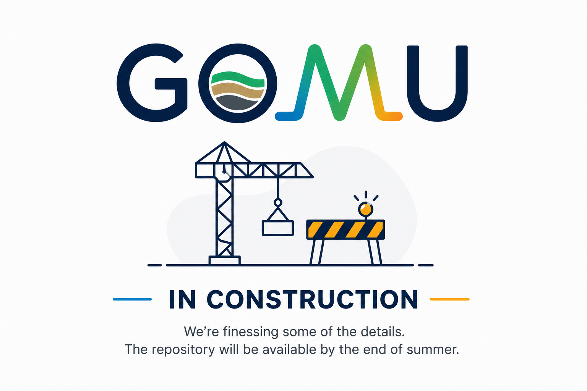

# GOMU
Geometry Object Modeling Utility

# GOMU — Geometry Object Modeling Utility

**GOMU is currently in development.**

GOMU is a geometry-first modelling utility for creating, varying, exporting, and documenting synthetic geophysical models. The current development focus is on GPR modelling with gprMax, with extensions toward ERT / pyGIMLi workflows and future multi-method geophysical modelling.

The first public repository release is planned by the end of summer.

## Planned contents

* GOMU interface source code
* Example subsurface models
* gprMax export workflow
* GPR dataset generation toolkit
* Example metadata/index files
* Documentation and usage examples
* Future ERT / pyGIMLi export examples

## Project status

This is a work-in-progress research prototype. It is not yet a complete digital twin platform or a validated diagnostic system.
